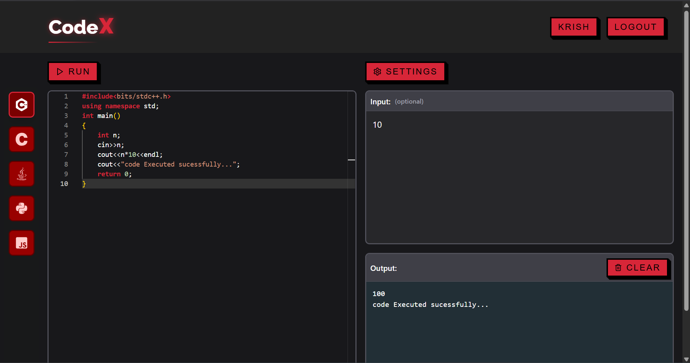
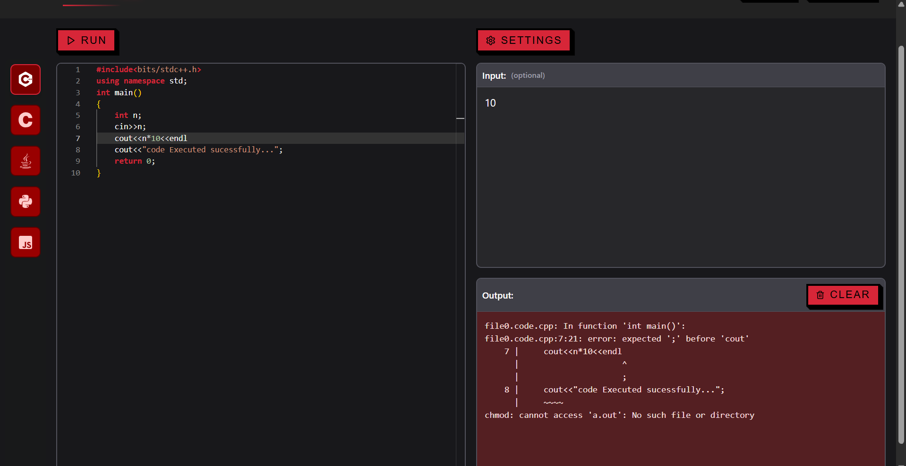

# CodeX - Online Code Execution Platform


## 📸 Application Screenshots

### 1. Executing Code Sucessfully


### 2. Proper Error Handling



## 🛠️ Setup Instructions

### 1. Prerequisites
- Node.js v16+
- npm v8+
- MongoDB Atlas account
- Git

### 2. Clone and Install
```bash
# Clone repository
git clone https://github.com/yourusername/codex.git
cd codex

# Install backend dependencies
cd backend
npm install

# Install frontend dependencies
cd ../frontend
npm install
```

### 3. Environment Configuration

#### Backend Configuration:
1. Navigate to backend directory:
```bash
cd backend
```

2. Create `.env` file:
```bash
touch .env
```

3. Open the `.env` file and add:
```env
PORT=7878
MONGO_URI=mongodb+srv://<username>:<password>@cluster0.example.mongodb.net/codex?retryWrites=true&w=majority
NODE_ENV=development
JWT_SECRET_KEY=your_secure_random_jwt_secret_here
```

4. Replace placeholders:
- `<username>`: Your MongoDB username
- `<password>`: Your MongoDB password
- `your_secure_random_jwt_secret_here`: Generate a strong secret key (min 32 chars)

#### Frontend Configuration (Optional):
Edit `frontend/src/config.js` if you need to change API base URL:
```javascript
export const API_BASE_URL = 'http://localhost:7878';
```

### 4. Running the Application

#### Start Backend Server:
```bash
cd backend
npm start
```
Expected output:
```
Server running on port 7878
MongoDB Connected
```

#### Start Frontend Development Server (in new terminal):
```bash
cd frontend
npm run dev
```
Expected output:
```
  Vite v4.0.0 ready in 500 ms

  ➜  Local:   http://localhost:3000/
  ➜  Network: use --host to expose
```

#### Access the Application:
Open your browser and visit:
```
http://localhost:3000
```

## 🚨 Troubleshooting
1. **MongoDB Connection Issues**:
   - Verify your connection string format
   - Check network access in MongoDB Atlas
   - Test connection with MongoDB Compass

2. **Port Conflicts**:
   ```bash
   # Find process using port 7878
   sudo lsof -i :7878
   
   # Kill the process (if needed)
   kill -9 <PID>
   ```

3. **Dependency Errors**:
   ```bash
   # In both backend and frontend directories:
   rm -rf node_modules package-lock.json
   npm install
   ```

4. **Environment Variables Not Loading**:
   - Ensure `.env` is in backend root
   - Restart server after changes
   - Never commit `.env` to git

## 📜 License
MIT License - See [LICENSE](LICENSE) for details.
```